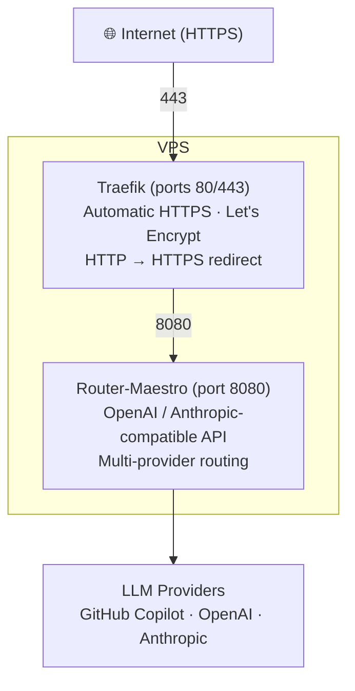

# Router-Maestro

[](https://github.com/MadSkittles/Router-Maestro/actions/workflows/ci.yml)
[](https://github.com/MadSkittles/Router-Maestro/actions/workflows/release.yml)

Multi-model routing router with OpenAI-compatible and Anthropic-compatible APIs. Route LLM requests across GitHub Copilot, OpenAI, Anthropic, and custom providers with intelligent fallback and priority-based selection.

## TL;DR

**Use GitHub Copilot's models (Claude, GPT-4o, o3-mini) with Claude Code or any OpenAI/Anthropic-compatible client.**

Router-Maestro acts as a proxy that gives you access to models from multiple providers through a unified API. Authenticate once with GitHub Copilot, and use its models anywhere that supports OpenAI or Anthropic APIs.

## Features

- **1M context support**: Activate Opus 4.6 *or* Opus 4.7 with a 1M context window via GitHub Copilot — just select `claude-opus-4-6[1m]` or `claude-opus-4-7[1m]` during `config claude-code` setup. Claude Code's `[1m]` beta header is auto-mapped to the right Copilot variant (`claude-opus-4.6-1m` / `claude-opus-4.7-1m-internal`).
- **Transparent reasoning-tier routing**: Requests for `claude-opus-4.7` with `reasoning_effort: "high"` or `"xhigh"` (or an Anthropic-style `thinking.budget_tokens` ≥ 8192) are auto-rewritten to the dedicated Copilot variants `claude-opus-4.7-high` / `claude-opus-4.7-xhigh` — no client changes needed.
- **Fuzzy model matching**: No need to type exact model IDs. Subagents, agent teams, and tools that hardcode model names (e.g. `opus-4-6`, `claude-sonnet-4.5`) are resolved automatically to the correct provider model
- **Multi-provider support**: GitHub Copilot (OAuth), OpenAI, Anthropic, and custom OpenAI-compatible endpoints
- **Intelligent routing**: Priority-based model selection with automatic fallback on failure
- **Dual API compatibility**: Both OpenAI (`/api/openai/v1/...`) and Anthropic (`/v1/messages`) API formats
- **Gemini API compatibility**: Gemini REST API format (`/api/gemini/v1beta/...`) for Gemini CLI/SDK
- **Cross-provider translation**: Seamlessly route OpenAI requests to Anthropic providers and vice versa
- **Configuration hot-reload**: Auto-reload config files every 5 minutes without server restart
- **CLI management**: Full command-line interface for configuration and server control
- **Docker ready**: Production-ready Docker images with Traefik integration

## Table of Contents

- [Quick Start](#quick-start)
- [Core Concepts](#core-concepts)
  - [Model Identification](#model-identification)
  - [Auto-Routing](#auto-routing)
  - [Priority & Fallback](#priority--fallback)
  - [Cross-Provider Translation](#cross-provider-translation)
  - [Contexts](#contexts)
- [CLI Reference](#cli-reference)
- [API Reference](#api-reference)
- [Configuration](#configuration)
- [Deployment](#deployment)
  - [Architecture](#architecture)
  - [Server and Client API Keys](#server-and-client-api-keys)
  - [Option A: Simple Docker (No HTTPS)](#option-a-simple-docker-no-https)
  - [Option B: Production (Docker Compose + Traefik + HTTPS)](#option-b-production-docker-compose--traefik--https)
  - [Remote Management](#remote-management)
  - [Advanced Configuration](#advanced-configuration)
- [License](#license)
- [Changelog](#changelog)

## Quick Start

Get up and running in 4 steps:

<https://github.com/user-attachments/assets/8f60ec7a-4fbe-4342-9408-084073a4d48d>

### 1. Start the Server

#### Docker (recommended)

```bash
docker run -d --name router-maestro \
  -p 8080:8080 \
  -v ~/.local/share/router-maestro:/home/maestro/.local/share/router-maestro \
  -v ~/.config/router-maestro:/home/maestro/.config/router-maestro \
  likanwen/router-maestro:latest

# The server generates an API key on first start if none is provided.
docker exec router-maestro router-maestro server show-key
```

#### Install locally

Terminal 1:

```bash
pip install router-maestro
router-maestro server start --port 8080
```

Terminal 2:

```bash
router-maestro server show-key
```

### 2. Set Client Context

A context is stored on the machine running the client CLI. If the server runs in Docker, on a VPS, or on another machine, install the CLI on the client machine and save the server endpoint plus the same server API key:

```bash
pip install router-maestro  # Run on the client machine, not necessarily on the server

router-maestro context add my-router \
  --endpoint http://localhost:8080 \
  --api-key "sk-rm-..."

router-maestro context set my-router

# Verifies the endpoint and API key against a protected admin route.
router-maestro auth list
```

Use the endpoint that the client can reach, for example `http://localhost:8080` for a local Docker container or `https://api.example.com` for a remote VPS. If you started the server locally with `router-maestro server start` on the same machine, the `local` context may already contain the generated key.

### 3. Authenticate with GitHub Copilot

```bash
router-maestro auth login github-copilot

# Follow the prompts:
#   1. Visit https://github.com/login/device
#   2. Enter the displayed code
#   3. Authorize "GitHub Copilot Chat"
```

### 4. Configure Your CLI Tool

#### Claude Code

```bash
router-maestro config claude-code
# Follow the wizard to select models.
# The active context's endpoint and API key are written to Claude Code settings.
```

#### OpenAI Codex (CLI, Extension, App)

```bash
router-maestro config codex
# Follow the wizard to select models.
# Codex reads the API key from this client-side environment variable.
# Add it to the client shell profile or app/extension environment:
export ROUTER_MAESTRO_API_KEY="sk-rm-..."
```

#### Gemini CLI

```bash
router-maestro config gemini
# Follow the wizard to select models.
# The active context's endpoint and API key are written to Gemini CLI config.
```

The API key is the Router-Maestro server key, not an OpenAI, Anthropic, Gemini, or GitHub token. Every remote client, generated tool config, or raw API call must use the same key that the server generated or was started with.

**Done!** Now run `claude`, `codex`, or `gemini` and your requests will route through Router-Maestro.

> **For production deployment**, see the [Deployment](#deployment) section.

## Core Concepts

### Model Identification

Models are identified using the format `{provider}/{model-id}`:

| Example                           | Description                         |
| --------------------------------- | ----------------------------------- |
| `github-copilot/gpt-4o` | GPT-4o via GitHub Copilot |
| `github-copilot/claude-sonnet-4` | Claude Sonnet 4 via GitHub Copilot |
| `openai/gpt-4-turbo` | GPT-4 Turbo via OpenAI |
| `anthropic/claude-3-5-sonnet` | Claude 3.5 Sonnet via Anthropic |

**Fuzzy matching**: You don't need to type exact model IDs. Router-Maestro will fuzzy-match common variations:

| You type              | Resolves to                      |
| --------------------- | -------------------------------- |
| `Opus 4.6`            | `claude-opus-4-6-20250617`       |
| `opus-4-6`            | `claude-opus-4-6-20250617`       |
| `claude-sonnet-4.5`   | `claude-sonnet-4-5-20250929`     |
| `anthropic/sonnet-4-5`| Sonnet 4.5 via Anthropic only    |

When multiple versions match, the newest (by date suffix) is selected automatically.

### Auto-Routing

Use the special model name `router-maestro` for automatic provider selection:

```json
{"model": "router-maestro", "messages": [...]}
```

The router will try models in priority order and fall back to the next on failure.

### Priority & Fallback

**Priority** determines which model is tried first when using auto-routing.

```bash
# Set priorities
router-maestro model priority add github-copilot/claude-sonnet-4 --position 1
router-maestro model priority add github-copilot/gpt-4o --position 2

# View priorities
router-maestro model priority list
```

**Fallback** triggers when a request fails with a retryable error (429, 5xx):

| Strategy     | Behavior                             |
| ------------ | ------------------------------------ |
| `priority` | Try next model in priorities list |
| `same-model` | Try same model on different provider |
| `none` | Fail immediately |

Configure in `~/.config/router-maestro/priorities.json`:

```json
{
  "priorities": ["github-copilot/claude-sonnet-4", "github-copilot/gpt-4o"],
  "fallback": {"strategy": "priority", "maxRetries": 2}
}
```

### Cross-Provider Translation

Router-Maestro automatically translates between OpenAI and Anthropic formats:

```bash
# Use Anthropic API with OpenAI provider
POST /v1/messages  {"model": "openai/gpt-4o", ...}

# Use OpenAI API with Anthropic provider
POST /api/openai/v1/chat/completions  {"model": "anthropic/claude-3-5-sonnet", ...}
```

### Contexts

A **context** is a named connection profile stored on the client machine. It contains the endpoint URL and Router-Maestro server API key for one deployment, so the same CLI can manage local Docker containers, remote VPS deployments, and other Router-Maestro servers.

| Context  | Use Case                                   |
| -------- | ------------------------------------------ |
| `local` | Default context for `router-maestro server start` |
| `docker` | Connect to a local Docker container |
| `my-vps` | Connect to a remote VPS deployment |

```bash
# Add a context with the server API key from `server show-key`
router-maestro context add my-vps --endpoint https://api.example.com --api-key sk-rm-...

# Switch contexts
router-maestro context set my-vps

# All CLI commands now target the remote server
router-maestro model list
```

## CLI Reference

### Server

| Command                    | Description        |
| -------------------------- | ------------------ |
| `server start --port 8080` | Start the server   |
| `server status` | Show server status |
| `server show-key` | Show current context API key |

### Authentication

| Command                 | Description                    |
| ----------------------- | ------------------------------ |
| `auth login [provider]` | Authenticate with a provider   |
| `auth logout <provider>` | Remove authentication |
| `auth list` | List authenticated providers |

### Models

| Command                            | Description            |
| ---------------------------------- | ---------------------- |
| `model list`                       | List available models  |
| `model refresh` | Refresh models cache |
| `model priority list` | Show priorities |
| `model priority add <model> --position <n>` | Add or move a priority |
| `model fallback show` | Show fallback config |

### Contexts (Remote Management)

| Command                                              | Description          |
| ---------------------------------------------------- | -------------------- |
| `context current`                                    | Show current context |
| `context list` | List all contexts |
| `context set <name>` | Switch context |
| `context add <name> --endpoint <url> --api-key <key>` | Add remote context |
| `context test` | Test connection |

### Other

| Command              | Description                   |
| -------------------- | ----------------------------- |
| `config claude-code` | Generate Claude Code settings |
| `config codex`       | Generate Codex config (CLI/Extension/App) |
| `config gemini`      | Generate Gemini CLI .env      |

## Local Integration Tests

The live-backend integration tests are local-only and are not part of GitHub
Actions. They start a local Router-Maestro server, reuse your existing
Router-Maestro config/auth files, and send requests to the real GitHub Copilot
backend. The suite covers model invocation paths only: OpenAI Chat, OpenAI
Responses, Anthropic Messages/count_tokens, Gemini generateContent/stream/countTokens,
tool calls, streaming, usage accounting, Anthropic thinking budgets, OpenAI
reasoning_effort, Gemini-family API calls, and the full Copilot model matrix by
default. Admin endpoints are intentionally not covered by these tests.

Prerequisites:

```bash
uv run router-maestro auth login github-copilot
```

Run them explicitly:

```bash
make integration-test
```

Optional overrides:

```bash
RM_INTEGRATION_MODEL=github-copilot/gpt-4o make integration-test
RM_INTEGRATION_TOOL_MODEL=github-copilot/gpt-4o make integration-test
RM_INTEGRATION_RESPONSES_MODEL=github-copilot/gpt-5.4-mini make integration-test
RM_INTEGRATION_MODELS=github-copilot/gpt-4o,github-copilot/claude-sonnet-4.5 make integration-test
RM_INTEGRATION_MAX_MODELS=8 make integration-test
RM_INTEGRATION_MAX_REASONING_MODELS=3 make integration-test
RM_INTEGRATION_MAX_REASONING_MODELS=0 make integration-test  # full reasoning sweep
```

## API Reference

### OpenAI-Compatible

```bash
# Chat completions
POST /api/openai/v1/chat/completions
{
  "model": "github-copilot/gpt-4o",
  "messages": [{"role": "user", "content": "Hello"}],
  "stream": false
}

# List models
GET /api/openai/v1/models
```

### Anthropic-Compatible

```bash
# Messages
POST /v1/messages
POST /api/anthropic/v1/messages
{
  "model": "github-copilot/claude-sonnet-4",
  "max_tokens": 1024,
  "messages": [{"role": "user", "content": "Hello"}]
}

# Count tokens
POST /v1/messages/count_tokens
```

### Admin

```bash
POST /api/admin/models/refresh   # Refresh model cache
```

### Gemini-Compatible

```bash
# Generate content (non-streaming)
POST /api/gemini/v1beta/models/{model}:generateContent
{
  "contents": [{"role": "user", "parts": [{"text": "Hello"}]}]
}

# Stream generate content (SSE)
POST /api/gemini/v1beta/models/{model}:streamGenerateContent?alt=sse
{
  "contents": [{"role": "user", "parts": [{"text": "Hello"}]}]
}

# Count tokens
POST /api/gemini/v1beta/models/{model}:countTokens
{
  "contents": [{"role": "user", "parts": [{"text": "Hello"}]}]
}
```

## Configuration

### File Locations

Following XDG Base Directory specification:

| Type       | Path                               | Contents                     |
| ---------- | ---------------------------------- | ---------------------------- |
| **Config** | `~/.config/router-maestro/` | |
| | `providers.json` | Custom provider definitions |
| | `priorities.json` | Model priorities and fallback |
| | `contexts.json` | Deployment contexts |
| **Data** | `~/.local/share/router-maestro/` | |
| | `auth.json` | OAuth tokens |
| | `server.json` | Legacy server state; current server API keys are stored in `contexts.json` |

### Custom Providers

Add OpenAI-compatible providers in `~/.config/router-maestro/providers.json`:

```json
{
  "providers": {
    "ollama": {
      "type": "openai-compatible",
      "baseURL": "http://localhost:11434/v1",
      "models": {
        "llama3": {"name": "Llama 3"},
        "mistral": {"name": "Mistral 7B"}
      }
    }
  }
}
```

Set API keys via environment variables (uppercase, hyphens → underscores):

```bash
export OLLAMA_API_KEY="sk-..."
```

### Hot-Reload

Configuration files are automatically reloaded every 5 minutes:

| File               | Auto-Reload      |
| ------------------ | ---------------- |
| `priorities.json` | ✓ (5 min) |
| `providers.json` | ✓ (5 min) |
| `auth.json` | Requires restart |

Force immediate reload:

```bash
router-maestro model refresh
```

## Deployment

### Architecture



- **Traefik** — reverse proxy that handles TLS termination and auto-renews HTTPS certificates via Let's Encrypt. Only needed for public-facing deployments.
- **Router-Maestro** — the API server. Listens on port 8080, requires an API key for all requests, and routes them to configured LLM providers.

### Server and Client API Keys

Router-Maestro has one server API key. The server uses it to protect every API route except public health/status endpoints, and every client must send that same key.

You can provide the key explicitly with `ROUTER_MAESTRO_API_KEY` or `router-maestro server start --api-key ...`. If you do not provide one, `router-maestro server start` generates a `sk-rm-...` key on first start and stores it in the server-side `local` context. This works in Docker too because the image starts the server with the same CLI command.

When server and client are on different machines, do not assume the server host has the `router-maestro` CLI outside Docker. Use one of these server-side commands to read the key, then copy it into the client machine's context:

```bash
# Docker run deployment
docker exec router-maestro router-maestro server show-key

# Docker Compose deployment
docker compose exec router-maestro router-maestro server show-key

# Non-Docker local install
router-maestro server show-key
```

On each client machine:

```bash
pip install router-maestro

router-maestro context add my-vps \
  --endpoint https://api.example.com \
  --api-key "sk-rm-..."

router-maestro context set my-vps
router-maestro auth list
```

Run `router-maestro config claude-code`, `router-maestro config codex`, or `router-maestro config gemini` from the client machine after selecting the context. The config commands use the active context endpoint; Claude Code and Gemini receive the API key in their generated config, while Codex uses `env_key = "ROUTER_MAESTRO_API_KEY"`, so set that environment variable on the Codex client machine to the same server key and keep it available when Codex runs.

### Option A: Simple Docker (No HTTPS)

**Use when:** local testing, running behind an existing reverse proxy (Nginx, Caddy, etc.), or on an internal network.

**Prerequisites:** Docker installed.

**Step 1 — Start the container**

```bash
docker run -d --name router-maestro \
  -p 8080:8080 \
  -v ~/.local/share/router-maestro:/home/maestro/.local/share/router-maestro \
  -v ~/.config/router-maestro:/home/maestro/.config/router-maestro \
  likanwen/router-maestro:latest
```

This command does not set `ROUTER_MAESTRO_API_KEY`; the server generates and persists one automatically. If you need a fixed key for automation, add `-e ROUTER_MAESTRO_API_KEY="sk-rm-..."`.

**Step 2 — Read the server API key**

```bash
docker exec router-maestro router-maestro server show-key
```

Save this key for client contexts and API calls.

**Step 3 — Authenticate with GitHub Copilot on the server**

```bash
docker exec -it router-maestro router-maestro auth login github-copilot
# 1. Visit the URL shown
# 2. Enter the code
# 3. Authorize "GitHub Copilot Chat"
```

**Step 4 — Configure each client machine**

Install the CLI on the client machine, not necessarily on the Docker host:

```bash
pip install router-maestro

router-maestro context add docker \
  --endpoint http://localhost:8080 \
  --api-key "sk-rm-..."

router-maestro context set docker
router-maestro config claude-code  # or: config codex / config gemini
```

For remote Docker hosts, replace `http://localhost:8080` with the URL reachable from the client.

**Step 5 — Verify**

```bash
curl http://localhost:8080/health
# Expected: {"status":"healthy"}

curl http://localhost:8080/api/openai/v1/models \
  -H "Authorization: Bearer sk-rm-..."
# Expected: JSON list of available models
```

### Option B: Production (Docker Compose + Traefik + HTTPS)

**Use when:** deploying to a public-facing VPS with a domain name. Provides automatic HTTPS via Let's Encrypt with Cloudflare DNS challenge.

**Prerequisites:**
- A VPS with Docker and Docker Compose installed
- A domain name (e.g., `api.example.com`) with DNS pointing to your VPS
- A Cloudflare account managing your domain's DNS (for automatic HTTPS)

**Step 1 — Clone the repository**

```bash
git clone https://github.com/MadSkittles/Router-Maestro.git
cd Router-Maestro
```

**Step 2 — Configure environment variables**

```bash
cp .env.example .env
```

Edit `.env` with your values:

| Variable | Description | Example |
|----------|-------------|---------|
| `DOMAIN` | Your domain pointing to this VPS | `api.example.com` |
| `CF_DNS_API_TOKEN` | Cloudflare API token with `Zone:DNS:Edit` permission. [Generate here](https://dash.cloudflare.com/profile/api-tokens) | `abc123...` |
| `ACME_EMAIL` | Email for Let's Encrypt certificate expiry notifications | `you@example.com` |
| `ROUTER_MAESTRO_API_KEY` | Optional fixed server API key. Leave blank, and do not set it in the shell running Docker Compose, to let the server generate and persist one. | `sk-rm-...` |
| `ROUTER_MAESTRO_LOG_LEVEL` | Log verbosity (`DEBUG`, `INFO`, `WARNING`, `ERROR`) | `INFO` |
| `TRAEFIK_DASHBOARD_AUTH` | (Optional) Basic auth for Traefik dashboard. Generate with `htpasswd -nB admin`, then escape `$` as `$$` | `admin:$$2y$$05$$...` |

**Step 3 — Start the services**

```bash
docker compose up -d
```

This starts both Traefik (reverse proxy) and Router-Maestro. Traefik will automatically obtain an HTTPS certificate for your domain.

**Step 4 — Read the server API key**

```bash
docker compose exec router-maestro router-maestro server show-key
```

If you set `ROUTER_MAESTRO_API_KEY` in `.env` or in the shell running Docker Compose, this prints that key. If you left it blank and it was not set in the shell, this prints the generated key stored in the server's mounted config.

**Step 5 — Authenticate with GitHub Copilot on the server**

```bash
docker compose exec router-maestro router-maestro auth login github-copilot
# 1. Visit the URL shown
# 2. Enter the code
# 3. Authorize "GitHub Copilot Chat"
```

**Step 6 — Set up remote management and client config**

```bash
pip install router-maestro   # run on the client machine

router-maestro context add my-vps \
  --endpoint https://api.example.com \
  --api-key "sk-rm-..."

router-maestro context set my-vps
router-maestro auth list
```

Now all CLI commands run against your VPS:

```bash
router-maestro model list          # list models on VPS
router-maestro auth list           # check auth status on VPS
router-maestro config claude-code  # configure Claude Code to use VPS
router-maestro config codex        # configure Codex; also export ROUTER_MAESTRO_API_KEY
```

For Codex clients, add the same key to the client shell profile or app/extension environment because the generated Codex config references `ROUTER_MAESTRO_API_KEY`:

```bash
export ROUTER_MAESTRO_API_KEY="sk-rm-..."
```

**Step 7 — Verify**

```bash
curl https://api.example.com/health
# Expected: {"status":"healthy"}

curl https://api.example.com/api/openai/v1/models \
  -H "Authorization: Bearer sk-rm-..."
# Expected: JSON list of available models
```

### Remote Management

Contexts let you manage any Router-Maestro server (local or remote) from your local CLI:

```bash
# Add a remote server with the server API key from `server show-key`
router-maestro context add my-vps --endpoint https://api.example.com --api-key sk-rm-...

# Switch between servers
router-maestro context set my-vps     # target remote VPS
router-maestro context set local      # target local server

# Test the connection
router-maestro context test

# All commands now target the active context
router-maestro model list
router-maestro auth login github-copilot
```

### Advanced Configuration

For additional deployment options, see [docs/deployment.md](docs/deployment.md):

- Alternative DNS providers (AWS Route53, DigitalOcean, GoDaddy, Namecheap, etc.)
- HTTP challenge setup (when DNS challenge is not available)
- Traefik dashboard configuration and security
- Complete environment variables reference

## License

MIT License - see [LICENSE](LICENSE) file.

## Changelog

See [CHANGELOG.md](CHANGELOG.md) for release history.

## Contributing

Contributions are welcome! Please feel free to submit a Pull Request.
