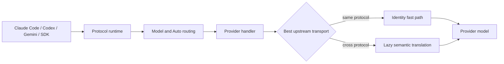

# Router-Maestro

[](https://github.com/MadSkittles/Router-Maestro/actions/workflows/ci.yml)
[](https://github.com/MadSkittles/Router-Maestro/actions/workflows/release.yml)
[](https://pypi.org/project/router-maestro/)

**Use the full GitHub Copilot model catalog from Claude Code, OpenAI Codex,
Gemini CLI, and any OpenAI-, Anthropic-, or Gemini-compatible client.**

Router-Maestro is a local or self-hosted model gateway. It separates the client
protocol from the upstream model transport, so a client is no longer limited to
models that natively speak its API. Claude Code can use Responses-only GPT
models; Codex can use Claude, Gemini, Grok, and MAI models; Gemini CLI can use
the same catalog through its native API surface.

<https://github.com/user-attachments/assets/35f7c0f5-967a-4f93-aec8-c34b460a0032>

## Why Router-Maestro

- **One Copilot subscription, every compatible client.** Authenticate once with
  GitHub Copilot and expose its live catalog—including GPT, Claude, Gemini,
  Grok, and MAI—to Claude Code, Codex, Gemini CLI, and API clients.
- **Protocol-independent routing.** Anthropic Messages, OpenAI Chat
  Completions, OpenAI Responses, and Gemini generation enter one dispatcher;
  providers choose the best Messages, Chat, or Responses upstream transport.
- **Native fast paths, translation only when needed.** Matching protocols use a
  copy-on-write identity path. Cross-protocol attempts lazily materialize a
  typed semantic representation and stream events without buffering the full
  response.
- **Tools, streaming, reasoning, and long context.** Router-Maestro preserves
  tool calls/results, structured output, usage, terminal outcomes, and
  reasoning continuation across supported protocol boundaries. Live catalog
  metadata advertises context choices such as `272K / 1M` to clients.
- **A real Auto model.** The virtual `router-maestro` model can classify work
  into Fast, General, Coding, or Deep Reasoning tasks, or follow a strict
  priority chain. Capability and context-window filtering happen before the
  model is selected.
- **Configuration for humans and agents.** Use searchable CLI wizards or the
  loopback-only visual portal to manage contexts, models, context windows,
  client configuration, trusted projects, and Auto routing.
- **Self-hosted control.** Run locally, in Docker, or behind HTTPS. Prometheus
  metrics, request IDs, stream guards, and opt-in audit traces support
  production diagnosis without sending routing control to a hosted portal.

## Supported Surface

### Clients and ingress protocols

| Client or API consumer | Router-Maestro surface | Full Copilot catalog |
| --- | --- | --- |
| Claude Code / Anthropic SDK | Anthropic Messages | Yes, including Responses-only GPT models |
| OpenAI Codex / OpenAI SDK | OpenAI Responses | Yes, including Claude, Gemini, Grok, and MAI |
| OpenAI-compatible clients | Chat Completions | Yes, subject to feature representability |
| Gemini CLI / Gemini SDK | Gemini `generateContent` | Yes, across available upstream transports |

### Providers

| Provider | Authentication | Upstream transports |
| --- | --- | --- |
| GitHub Copilot | OAuth device flow | Messages, Chat, Responses as advertised by each model |
| OpenAI | API key | OpenAI-compatible transport |
| Anthropic | API key | Anthropic Messages |
| Custom OpenAI-compatible | API key, environment key, or explicit anonymous mode | Chat Completions |

Unsupported cross-protocol fields fail explicitly before provider I/O rather
than being silently dropped.

## How It Works


```mermaid
flowchart LR
    C[Claude Code / Codex / Gemini / SDK] --> P[Protocol runtime]
    P --> R[Model and Auto routing]
    R --> H[Provider handler]
    H --> T{Best upstream transport}
    T -->|same protocol| I[Identity fast path]
    T -->|cross protocol| S[Lazy semantic translation]
    I --> U[Provider model]
    S --> U
```

Provider handlers own their catalog, authentication, endpoint bindings,
transport preference, and provider-specific contracts. Routing selects a model;
the handler selects how to call it. Model fallback begins only after the
selected model's viable transports are exhausted.

## Five-Minute Local Start

Prerequisites:

- [uv](https://docs.astral.sh/uv/) or another Python 3.14 package installer
- an active GitHub Copilot subscription for Copilot-backed models

Install the CLI and server:

```bash
uv tool install --python 3.14 router-maestro
```

Start Router-Maestro in one terminal:

```bash
router-maestro server start
```

The first start creates a local context and a `sk-rm-...` server API key. In a
second terminal, authenticate and open the visual configurator:

```bash
router-maestro auth login github-copilot
router-maestro web
```

Or configure a client from the terminal:

```bash
router-maestro config claude-code
router-maestro config codex
router-maestro config gemini
```

The wizard reads the active server's live model catalog, lets you choose the
model and context window, and previews or backs up the target configuration.
For Codex it can also refresh `router-maestro-models.json`, so custom model
metadata is available when the next Codex session starts.

Verify the server and catalog:

```bash
curl http://localhost:8080/health
router-maestro model list
```

For Docker, a VPS, HTTPS, upgrades, and rollback, follow the
[Deployment Guide](docs/deployment.md). For all client and provider choices,
follow the [Configuration Guide](docs/configuration.md). Both guides include
prompts that can be pasted directly into an AI coding agent.

To delegate the work, start at
[AI-assisted deployment](docs/deployment.md#ai-assisted-deployment) or
[AI-assisted client configuration](docs/configuration.md#ai-assisted-client-configuration).

## Router-Maestro Auto

Select the virtual model ID `router-maestro` to enable server-side automatic
routing. New configurations default to **Smart Auto**:

1. A configured router model classifies the request as `fast`, `general`,
   `coding`, or `deep_reasoning`.
2. The corresponding configured task model becomes the first candidate.
3. Capability requirements and the estimated input size filter unsafe models.
   Router-Maestro normally keeps candidates below 70% of their advertised
   prompt capacity to leave room for tokenizer and protocol differences.
4. If no model satisfies that safety margin, all configured models tied for the
   largest hard-compatible context window remain eligible.
5. A precise upstream context-overflow response may retry a larger configured
   model before the first response frame; committed streams are never replayed.

**Priority Chain** mode is available when deterministic ordering is preferred.
Its configured fallback chain must not be empty.

Configure either mode with:

```bash
router-maestro model auto configure
# or
router-maestro web
```

See [Auto routing and client configuration](docs/configuration.md#router-maestro-auto)
for policy details.

## Stable API Endpoints

New integrations should use the stable paths:

| API | Endpoint |
| --- | --- |
| OpenAI Chat Completions | `/api/openai/v1/chat/completions` |
| OpenAI Responses | `/api/openai/v1/responses` |
| OpenAI model list | `/api/openai/v1/models` |
| Anthropic Messages | `/api/anthropic/v1/messages` |
| Anthropic token count | `/api/anthropic/v1/messages/count_tokens` |
| Gemini generation | `/api/gemini/v1beta/models/{model}:generateContent` |
| Gemini streaming | `/api/gemini/v1beta/models/{model}:streamGenerateContent` |

`/api/gemini/v1beta` is the Gemini protocol version, not a Router-Maestro beta
route. Older Router-Maestro beta aliases remain compatibility paths only and
should not be used for new configuration.

Authenticated inference and administration use the same Router-Maestro server
API key. `/health` is public. `/metrics` is public unless a separate metrics
token is configured. Treat the server key as both inference and configuration
authority.

## Documentation

### Use and operations

- [Configuration Guide](docs/configuration.md) — contexts, providers, CLI and
  Web configuration, Claude Code, Codex, Gemini CLI, Auto, and AI-agent prompts
- [Deployment Guide](docs/deployment.md) — native, Docker, VPS, Traefik/HTTPS,
  upgrades, rollback, multi-instance keys, and AI-agent prompts
- [Metrics and Observability](docs/observability.md) — Prometheus metrics,
  request IDs, terminal outcomes, audit artifacts, and troubleshooting
- [Copilot Context Limits](docs/copilot-context-limits.md) — catalog context
  metadata and prompt/output budgeting
- [Tool Choice Behavior](docs/tool-choice-behavior.md) — tool-choice and finish
  semantics across providers

### Protocol and engineering reference

- [API Translation and Protocol Contracts](docs/api-translation.md) — ingress,
  transport bindings, semantic conversion, streaming, and error policy
- [Token Calculation](docs/token-calculation.md) — context budgeting, token
  counting, and thinking-budget normalization
- [Python 3.14 and Slim Image Design](docs/python-314-and-slim-image-design.md)
- [Python 3.14 and Slim Image Implementation Plan](docs/python-314-and-slim-image-plan.md)

Historical design records:

- [Provider-bound option policy](docs/superpowers/specs/2026-07-15-provider-bound-option-policy-design.md)
  and its [round-two design](docs/superpowers/specs/2026-07-15-provider-bound-option-policy-round2-design.md)
- [Option guard audit](docs/superpowers/specs/2026-07-15-option-guard-audit.md)
- [Streaming keepalive gap design](docs/superpowers/specs/2026-07-21-beta-stream-keepalive-gap-design.md)
- [Copilot reasoning sanitization](docs/superpowers/specs/2026-07-22-copilot-reasoning-sanitize-design.md)
- [Copilot token-refresh resilience](docs/superpowers/specs/2026-07-22-copilot-token-refresh-resilience-design.md)
- [Reasoning path consistency](docs/superpowers/specs/2026-07-23-reasoning-path-consistency-design.md)
- Implementation plans: [option policy round one](docs/superpowers/plans/2026-07-15-provider-bound-option-policy-round1.md),
  [option policy round two](docs/superpowers/plans/2026-07-15-provider-bound-option-policy-round2.md),
  [reasoning sanitization](docs/superpowers/plans/2026-07-22-copilot-reasoning-sanitize.md),
  [token refresh](docs/superpowers/plans/2026-07-22-copilot-token-refresh-resilience.md),
  and [reasoning consistency](docs/superpowers/plans/2026-07-23-reasoning-path-consistency.md)

### Project

- [Contributing Guide](CONTRIBUTING.md) — development setup, architecture
  boundaries, tests, audit tracing, live validation, and pull requests
- [Changelog](CHANGELOG.md)
- [License](LICENSE)

## Contributing

Contributions are welcome. Start with [CONTRIBUTING.md](CONTRIBUTING.md), which
includes the required offline gates, live-provider test boundaries, and a safe
audit workflow for protocol investigations.

## License

Router-Maestro is available under the [MIT License](LICENSE).
